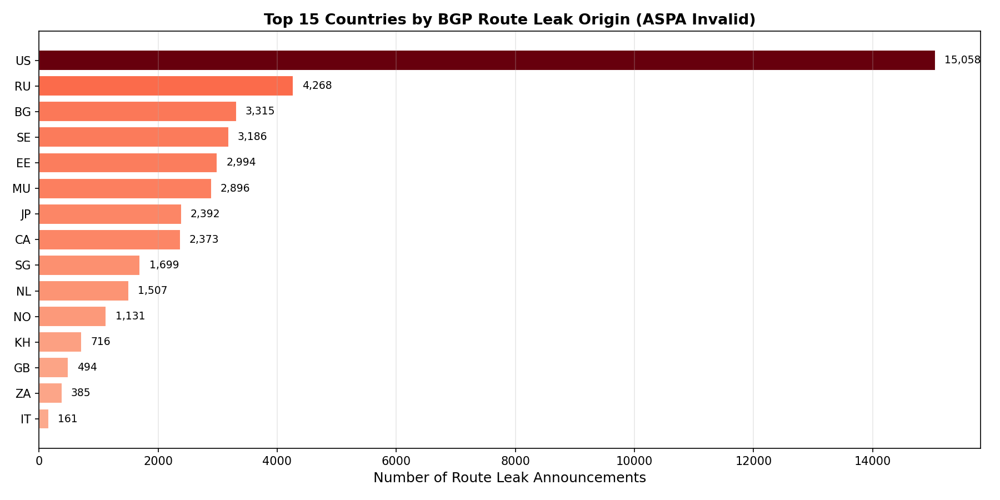
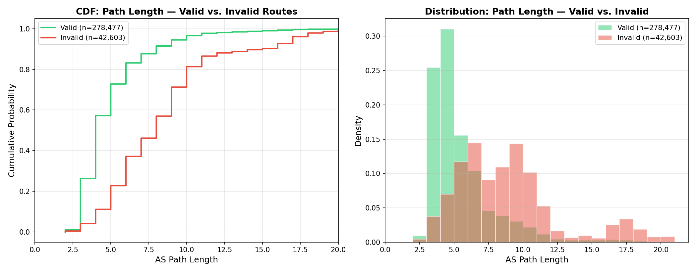
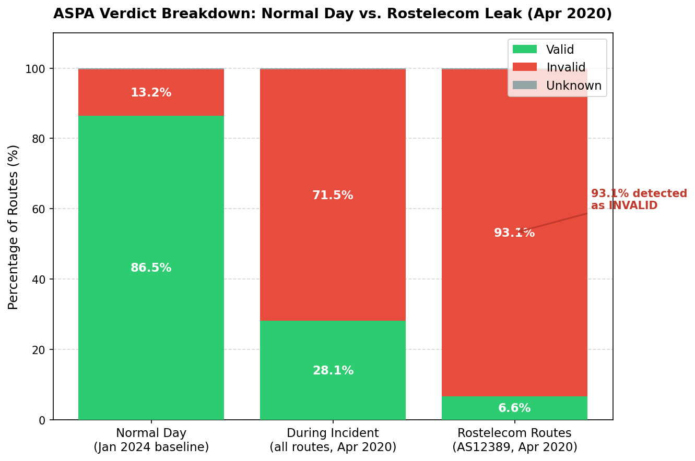

# BGP Route Leak Detection with ASPA

This project builds a tool that reads real internet routing data, checks each route for signs of misuse, and measures how well a new security method called ASPA would have prevented those problems.

The full written report is in [`report/REPORT.md`](report/REPORT.md). This README focuses on the code.

---

## What the project does in plain words

Every time you visit a website, your data travels through a chain of networks. Each network hands data to the next using a system called BGP. BGP was built without much security, so a network can accidentally (or intentionally) claim it can route traffic it should not be handling. This is called a **route leak**.

This project:
1. Downloads a snapshot of real routing data from a public archive.
2. Loads a security database that says which networks are allowed to hand traffic to which.
3. Checks every route in the snapshot against that database.
4. Reports how many routes look suspicious and what they have in common.

---

## Before you run anything

### Requirements

- Python 3.10 inside a conda environment named `bgp_aspa`
- The `pybgpstream` library and its C dependencies (`libwandio`, `libbgpstream`) built from source
- `Routinator` (a tool that fetches internet security records) installed at `~/.cargo/bin/routinator`

All of these were set up during the project's Phase 1. If you are revisiting this project on a new machine, see `PROJECT_GUIDELINE.md` Section 3 for the full setup steps.

### Activate the environment

```bash
conda activate bgp_aspa
```

### Data files

The `data/` folder is not included in this repository (it is too large). The scripts expect the following files to be present:

| File | How to get it |
|---|---|
| `data/rpki_vrps_with_aspa.json` | Run `routinator vrps --format json --enable-aspa > data/rpki_vrps_with_aspa.json` |
| `data/20240101.as-rel2.txt.bz2` | Download from [CAIDA AS-relationships](https://www.caida.org/catalog/datasets/as-relationships/) |
| `data/delegated-*.txt` (5 files) | Download from each Regional Internet Registry (ARIN, RIPE NCC, APNIC, LACNIC, AFRINIC) |

---

## Folder layout

```
.
├── src/                   All Python scripts
├── data/                  Input data files (not in git — too large)
├── output/                Results produced by the scripts (not in git)
├── report/
│   ├── REPORT.md          Full written report with results and charts
│   └── charts/            Saved chart images (in git)
└── PROJECT_GUIDELINE.md   Detailed technical notes on every phase
```

---

## How the scripts fit together

The scripts run in order. Each one feeds its output into the next.

```
Step 1: ingest.py          → downloads routing data  → output/ingested_updates.csv
Step 2: aspa_cache.py      → loads the security database (used by all later scripts)
Step 3: aspa_verifier.py   → the checking algorithm   (used by all later scripts)
Step 4: analyze.py         → runs the check on all routes → output/statistics_*.json
         └── Research scripts (run independently after Step 4):
               partial_deployment.py
               rov_comparison.py
               geo_analysis.py
               path_length_analysis.py
               incident_replay.py
```

`src/config.py` is a small helper imported by every script. It holds the shared folder paths and a function that reads the routing data CSV. You do not run it directly.

---

## Running each script

All commands should be run from the root of the repository with the conda environment active.

### Step 1 — Download routing data

```bash
python src/ingest.py
```

Connects to the RouteViews public archive and downloads 15 minutes of real routing announcements from January 15, 2024. Saves them to `output/ingested_updates.csv` (~322,000 routes).

> This step requires an internet connection and takes a few minutes.

---

### Step 2+3 — No action needed

`src/aspa_cache.py` and `src/aspa_verifier.py` are libraries, not standalone programs. They are imported by the scripts below. You can verify that the checking algorithm works correctly by running:

```bash
python src/aspa_verifier.py
```

This runs 8 built-in tests and prints `All self-tests passed ✓`.

---

### Step 4 — Run the main analysis

```bash
python src/analyze.py
```

Reads the routing data from Step 1, checks every route, and produces:

| Output file | What it contains |
|---|---|
| `output/all_results_caida.csv` | Every route with its verdict (using the simulated full-deployment database) |
| `output/flagged_routes_caida.csv` | Only the routes that failed the check |
| `output/statistics_caida.json` | Summary counts and percentages |
| `output/all_results_routinator.csv` | Same, but using real-world security records |
| `output/flagged_routes_routinator.csv` | — |
| `output/statistics_routinator.json` | — |

Runs in about 5 seconds.

---

### Research scripts (run in any order after Step 4)

Each of these answers a specific research question. They all read from files that Step 4 already produced.

#### How does protection improve as more networks join?

```bash
python src/partial_deployment.py
```

Simulates 10% through 100% of networks publishing security records and measures how many bad routes would be caught at each level.

Saves: `output/partial_deployment_stats.json`, `output/charts/partial_deployment_curve.png`


The left axis (blue line) shows how many suspicious routes get caught. The right axis (green line) shows what share of routes can be checked at all. Detection peaks around 50% adoption, then falls as more routes get confirmed as legitimate.

---

#### Does this method catch different problems than the existing method?

```bash
python src/rov_comparison.py
```

Runs two different checks on the same data — one that only inspects the first network in a route (the existing method, called ROV) and one that inspects the entire route (ASPA). Shows how many routes each method catches on its own vs. together.

Saves: `output/rov_vs_aspa_stats.json`, `output/charts/roa_vs_aspa_venn.png`


The two circles show routes flagged by each method. The large right circle (ASPA-only) shows that checking the full route catches significantly more problems than the existing approach alone.

---

#### Which countries are the biggest sources of problem routes?

```bash
python src/geo_analysis.py
```

Maps each flagged network to its country of registration using public records from the five Regional Internet Registries, then counts by country.

Saves: `output/geo_stats.json`, `output/charts/leaks_by_country.png`, `output/charts/leaks_by_rir.png`



The US ranks first because it has the most registered networks. Russia and Bulgaria stand out despite their smaller size — even one misconfigured network in a well-connected position can affect thousands of routes.

---

#### Are routes with problems noticeably longer than normal ones?

```bash
python src/path_length_analysis.py
```

Compares the number of hops in flagged routes vs. clean routes and tests whether the difference is statistically meaningful.

Saves: `output/charts/path_length_cdf.png` and prints test results to the console.



The red curve (invalid routes) is shifted noticeably to the right — flagged routes have on average 3.4 more hops than clean ones. This gap is statistically significant (p ≈ 0), meaning it is not random chance.

---

#### Would this method have caught a real incident?

```bash
python src/incident_replay.py
```

Re-downloads routing data from April 1, 2020 — the date of the Rostelecom leak, a documented case where a Russian network accidentally redirected traffic for Cloudflare, Amazon, and others — and runs the same check on it.

> This step requires an internet connection and takes several minutes (fetches ~1 million routes).

Saves: `output/incident_case_study.json`, `output/charts/incident_aspa_verdicts.png`



The three bars show the same check applied to three different snapshots. On a normal day (left) most routes pass. During the incident (middle) the invalid share jumps dramatically. Looking only at Rostelecom's routes (right), 93.1% are flagged — the tool would have identified and blocked the leak.

---

## Key results at a glance

| Question | Answer |
|---|---|
| Bad routes under full deployment | 13.2% of all observed routes |
| Bad routes detectable today | 8.2% (limited by low adoption) |
| Routes unverifiable today | 91.8% (not enough networks have published records) |
| Detection rate at 50% adoption | 34.7% — the peak |
| Additional catches vs. existing method | ASPA catches 12.7% more routes that the existing check misses |
| Detection rate on real 2020 incident | 93.1% of Rostelecom's leaked routes flagged |

Full results with charts are in [`report/REPORT.md`](report/REPORT.md).

---

## Where to look for what

| If you want to understand… | Look at… |
|---|---|
| The security-checking algorithm | `src/aspa_verifier.py` |
| How the security database is loaded | `src/aspa_cache.py` |
| The main analysis pipeline | `src/analyze.py` |
| Any individual research finding | The matching script in `src/` |
| All results with explanations | `report/REPORT.md` |
| Detailed technical setup notes | `PROJECT_GUIDELINE.md` |
