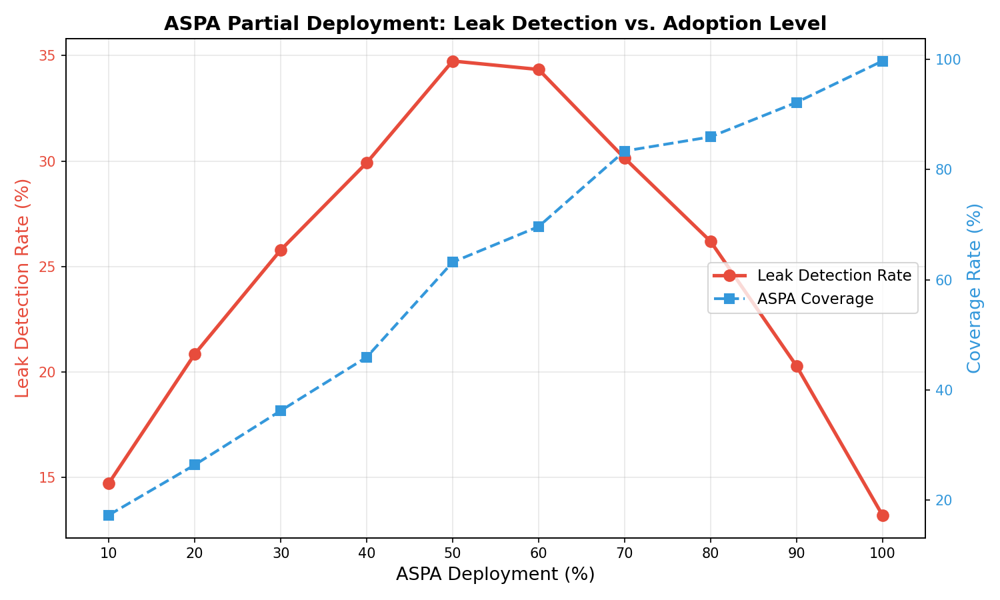
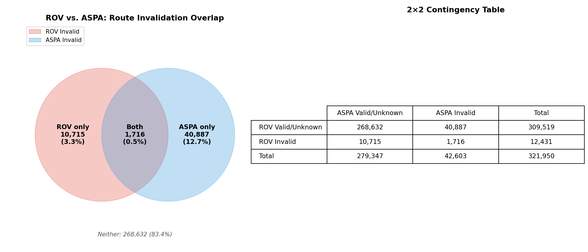
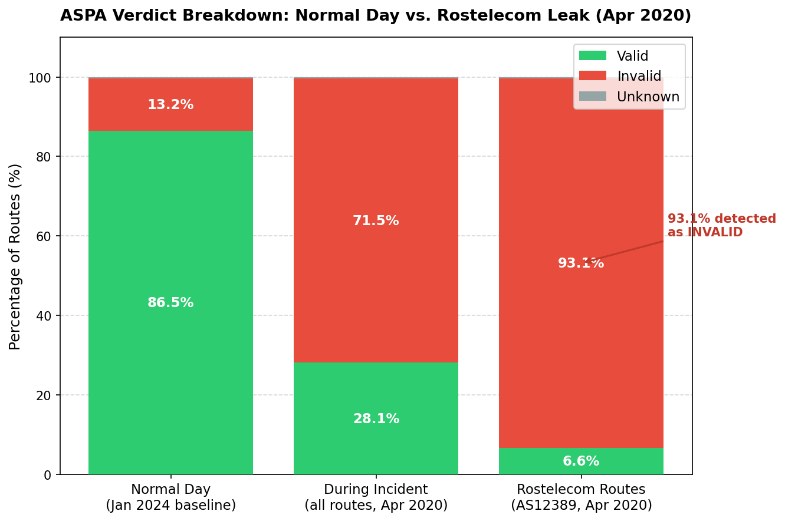

# BGP Route Leak Detection with ASPA

## Table of Contents

1. [What This Project Is About](#1-what-this-project-is-about)
2. [Background](#2-background)
3. [The Question We Answer](#3-the-question-we-answer)
4. [Setup and Requirements](#4-setup-and-requirements)
5. [Folder Layout](#5-folder-layout)
6. [How the Scripts Fit Together](#6-how-the-scripts-fit-together)
7. [Phase 2 — Collecting Routing Data](#7-phase-2--collecting-routing-data)
8. [Phase 3 — Loading the Security Database](#8-phase-3--loading-the-security-database)
9. [Phase 4 — The Checking Algorithm and Main Analysis](#9-phase-4--the-checking-algorithm-and-main-analysis)
10. [Research 1 — How Does Protection Scale with Adoption?](#10-research-1--how-does-protection-scale-with-adoption)
11. [Research 2 — ASPA vs. the Existing Method (ROV)](#11-research-2--aspa-vs-the-existing-method-rov)
12. [Research 3 — Which Countries Have the Most Problem Routes?](#12-research-3--which-countries-have-the-most-problem-routes)
13. [Research 4 — Are Problem Routes Longer?](#13-research-4--are-problem-routes-longer)
14. [Research 5 — Testing Against a Real Incident](#14-research-5--testing-against-a-real-incident)
15. [Summary of Findings](#15-summary-of-findings)
16. [File Reference](#16-file-reference)

---

## 1. What This Project Is About

Every time you visit a website, your data travels through a chain of networks. Each network hands your data to the next one using a system called BGP. BGP was built without much security — any network can claim it knows the best route to any destination, and its neighbors will trust that claim. When a network announces routes it should not, it is called a **route leak**. Route leaks can cause outages, slow down the internet, or redirect traffic through the wrong networks.

A new security method called **ASPA** lets each network publish a signed list of who is allowed to carry its traffic. Routers can then check every step in a route and reject the ones that look wrong.

This project builds a tool that:
1. Downloads a snapshot of real routing data from a public archive.
2. Loads ASPA security records that say which networks are allowed to hand traffic to which.
3. Checks every route against those records.
4. Measures how many routes look suspicious and explores what they have in common.

---

## 2. Background

### How internet routing works

Think of the internet as a highway system. Each independently operated network (called an Autonomous System, or AS) is like a city with a unique number. For example, AS13335 is Cloudflare, and AS16509 is Amazon AWS. When you visit a website, your data passes through a series of these networks — this chain is called an **AS path**.

```
Your ISP (AS100) → Transit Provider (AS200) → Cloudflare (AS13335)
                   AS path = [100, 200, 13335]
```

Networks have business relationships:

| Relationship | What it means | Example |
|---|---|---|
| **Customer → Provider** | The customer pays the provider for internet access | A small ISP pays a large carrier |
| **Peer ↔ Peer** | Two networks exchange traffic for free, but only for their own customers | Two large ISPs agree to share |

A basic rule in routing is the **valley-free property**: a route should go *up* through providers, optionally cross one *peer* link, then go *down* through customers. If a route breaks this pattern, something is likely wrong.

### What is a route leak?

A route leak happens when a network announces routes it should not:

```
Normal:     Customer → Provider → Internet
Route Leak: Customer → Provider A → Customer re-announces to Provider B
            (The customer should NOT pass Provider A's routes to Provider B)
```

This can cause outages, redirect traffic through untrusted networks, or even allow surveillance.

### What is ASPA?

ASPA is a new standard being developed by the IETF (the organization that designs internet standards). It works like this:

1. Each network publishes a signed record listing its **authorized upstream providers**.
2. When a router receives a route, it checks each step in the path against these records.
3. If any step is unauthorized (e.g., network X claims to be a provider of network Y, but Y's record says otherwise), the route is flagged as **invalid**.

### ASPA vs. ROV — two different checks

There is already an existing security method called ROV that uses records called ROAs. Here is how the two compare:

| | ROV (existing method) | ASPA (new method) |
|---|---|---|
| **What it checks** | Is the first network in the route allowed to announce this address range? | Is the entire chain of networks in the route structurally valid? |
| **What it catches** | Someone pretending to own addresses they do not | A network passing traffic through places it should not go |
| **How deep it looks** | First network only | Every step in the path |

They catch different kinds of problems — using both gives much better coverage than using either alone.

---

## 3. The Question We Answer

> **"If every network on the internet enforced ASPA today, what percentage of observed routes would be blocked as suspicious?"**

We answer this by:
1. Collecting **321,950 real route announcements** from the RouteViews archive.
2. Loading ASPA records from both real signed data and a simulated full-deployment dataset.
3. Running every route through our checking algorithm.
4. Counting how many routes get flagged.

---

## 4. Setup and Requirements

### What you need

- Python 3.10 inside a conda environment named `bgp_aspa`
- The `pybgpstream` library and its C dependencies (`libwandio`, `libbgpstream`) built from source
- `Routinator` (a tool that fetches internet security records) installed at `~/.cargo/bin/routinator`

All of these were set up during Phase 1 of the project. If you are setting up on a new machine, see `PROJECT_GUIDELINE.md` Section 3 for the full steps.

### Activate the environment

```bash
conda activate bgp_aspa
```

### Data files

The `data/` folder is not in this repository because the files are too large. The scripts expect these files to be present:

| File | How to get it |
|---|---|
| `data/rpki_vrps_with_aspa.json` | Run `routinator vrps --format json --enable-aspa > data/rpki_vrps_with_aspa.json` |
| `data/20240101.as-rel2.txt.bz2` | Download from [CAIDA AS-relationships](https://www.caida.org/catalog/datasets/as-relationships/) |
| `data/delegated-*.txt` (5 files) | Download from each Regional Internet Registry (ARIN, RIPE NCC, APNIC, LACNIC, AFRINIC) |

---

## 5. Folder Layout

```
.
├── src/                   All Python scripts (10 files)
├── charts/                Saved chart images (in this repository)
├── data/                  Input data files (not in git — too large)
├── output/                Results produced by the scripts (not in git)
└── PROJECT_GUIDELINE.md   Detailed technical setup notes
```

---

## 6. How the Scripts Fit Together

The scripts run in order. Each one feeds its output into the next.

```
Phase 2: ingest.py          → downloads routing data  → output/ingested_updates.csv
Phase 3: aspa_cache.py      → loads the security database (used by all later scripts)
Phase 4: aspa_verifier.py   → the checking algorithm   (used by all later scripts)
         analyze.py         → runs the check on all routes → output/statistics_*.json
              │
              └── Research scripts (run independently after Phase 4):
                    partial_deployment.py
                    rov_comparison.py
                    geo_analysis.py
                    path_length_analysis.py
                    incident_replay.py
```

`src/config.py` is a small helper imported by every script. It holds the shared folder paths and a function that reads the routing data CSV. You do not run it directly.

All commands below should be run from the root of the repository with the conda environment active.

---

## 7. Phase 2 — Collecting Routing Data

**Code file:** `src/ingest.py`

```bash
python src/ingest.py
```

This script connects to the University of Oregon's RouteViews public archive and downloads 15 minutes of real routing announcements (January 15, 2024, 00:00–00:15 UTC).

```
RouteViews Archive (public server)
        │
        ▼ pybgpstream library
    ┌──────────┐
    │ ingest.py │  Reads live routing messages
    └────┬─────┘
         │
         ▼
   output/ingested_updates.csv (321,950 routes)
```

**What the code does:**
- `stream_bgp_updates()` connects to the archive and reads the routing messages one at a time.
- `parse_as_path()` converts the raw path string (e.g., `"3356 174 13335"`) into a clean list of network numbers `[3356, 174, 13335]`.
- `save_to_csv()` writes everything to a CSV with columns: timestamp, address range, path, and source.

**Output:** `output/ingested_updates.csv` — 321,950 rows, each one representing a network saying "I know how to reach this address range via this path."

> Requires an internet connection. Takes a few minutes.

---

## 8. Phase 3 — Loading the Security Database

**Code file:** `src/aspa_cache.py`

This is a library, not a standalone script — it is imported by the scripts in Phase 4 and the research scripts.

It loads the "address book" of authorized provider relationships — the information our checker uses to decide if a route is legitimate.

### Where the data comes from

| Source | File | What it provides | How many records |
|---|---|---|---|
| **Routinator (real signed records)** | `data/rpki_vrps_with_aspa.json` | Signed ASPA records from the global internet security system | 1,543 records |
| **CAIDA (simulated full deployment)** | `data/20240101.as-rel2.txt.bz2` | Customer-provider relationships inferred from real internet topology | 75,865 records |

### Why use two sources?

ASPA is very new. Only 1,543 networks (out of roughly 75,000) have published real ASPA records so far. That means we can only verify a tiny fraction of routes using real data.

The CAIDA dataset contains inferred relationships for almost all networks. We use it to answer the "what if" question: what would happen if *every* network published ASPA records?

### How the code works

The `ASPACache` class builds a lookup table in memory. Think of it as a dictionary:

```python
{
    13335: [174, 1299, 2914],       # Cloudflare's authorized providers
    16509: [7018, 3356, 174],       # Amazon's authorized providers
    ...
}
```

Key functions:
- `load_from_routinator_json()` reads the real signed records.
- `load_from_caida_relationships()` reads the simulated records from CAIDA.
- `is_provider_of(provider, customer)` answers: "Is this provider authorized for this customer?"
- `is_peer_of(a, b)` answers: "Do these two networks have an equal-exchange relationship?"

---

## 9. Phase 4 — The Checking Algorithm and Main Analysis

**Code files:** `src/aspa_verifier.py` (the checker), `src/analyze.py` (runs the checker on all routes)

### The checker (`aspa_verifier.py`)

This is the heart of the project. For each route, it walks through the path step by step and asks: "Is each of these network-to-network handoffs authorized?"

You can verify it works correctly by running:

```bash
python src/aspa_verifier.py
```

This runs 8 built-in tests and prints `All self-tests passed ✓`.

**How it works in detail:**

1. **Remove duplicates** — Sometimes a network repeats itself in the path on purpose (called "prepending"). The checker strips those out first. For example, `[100, 100, 200]` becomes `[100, 200]`.

2. **Check each step** — For every pair of adjacent networks in the path, it looks up: "Is this handoff authorized?"

   ```
   Path: [100, 200, 300, 13335]

   Step 1: 100 → 200  →  Is 200 an authorized provider of 100?  ✓ yes (going up)
   Step 2: 200 → 300  →  Is 300 an authorized provider of 200?  ✓ yes (going up)
   Step 3: 300 → 13335 → Is 13335 a customer of 300?            ✓ yes (going down)
   ```

3. **Check the valley-free rule** — A valid path should go UP, optionally cross one PEER link, then go DOWN. Any other pattern is a red flag:

   ```
   Valid:   UP → UP → PEER → DOWN → DOWN    ✓
   Valid:   UP → UP → DOWN → DOWN            ✓
   Invalid: UP → DOWN → UP                   ✗ (this is a "valley" — something went wrong)
   ```

4. **Return a verdict:**
   - **Valid** — Every step is authorized and the path shape is correct.
   - **Invalid** — At least one step is unauthorized (possible route leak).
   - **Unknown** — Not enough records exist to decide.

### The main analysis (`analyze.py`)

```bash
python src/analyze.py
```

This script ties everything together. It loads all 321,950 routes, runs each one through the checker, and saves the results.

It runs the analysis **twice** to compare two scenarios:
- Using the **CAIDA** database (simulated full deployment — "what if everyone had ASPA?")
- Using the **Routinator** database (real records today — "what can we actually detect right now?")

**Output files:**

| File | What it contains |
|---|---|
| `output/all_results_caida.csv` | Every route with its verdict (simulated full deployment) |
| `output/flagged_routes_caida.csv` | Only the routes that failed (simulated) |
| `output/statistics_caida.json` | Summary counts and percentages (simulated) |
| `output/all_results_routinator.csv` | Every route with its verdict (real records) |
| `output/flagged_routes_routinator.csv` | Only the routes that failed (real) |
| `output/statistics_routinator.json` | Summary counts and percentages (real) |

Runs in about 5 seconds.

### Results

**Scenario 1 — Simulated full deployment (CAIDA): "What if every network had ASPA?"**

| Verdict | Routes | Percentage |
|---|---|---|
| **Valid** | 278,477 | 86.5% |
| **Invalid** (suspected leak) | 42,603 | 13.2% |
| **Unknown** | 870 | 0.3% |

Under full deployment, **13.2% of observed routes would be flagged** — roughly 1 in 8 routes had a path that broke the rules.

**Scenario 2 — Real records today (Routinator): "What can we detect right now?"**

| Verdict | Routes | Percentage |
|---|---|---|
| **Valid** | 6 | 0.0% |
| **Invalid** | 26,517 | 8.2% |
| **Unknown** | 295,427 | 91.8% |

With only 1,543 real ASPA records, **91.8% of routes cannot be checked at all**. This shows how urgently the internet needs broader ASPA adoption.

---

## 10. Research 1 — How Does Protection Scale with Adoption?

**Code file:** `src/partial_deployment.py`

```bash
python src/partial_deployment.py
```

**Question:** What happens as more and more networks publish ASPA records — does protection grow gradually, or is there a tipping point?

**What the code does:**
1. `build_subsampled_cache()` takes the full CAIDA database and randomly keeps only a fraction (10%, 20%, etc.) to simulate different adoption levels.
2. `sweep()` runs the checker at each level and records how many bad routes are caught.
3. `plot_curve()` draws a chart with two lines — detection rate and coverage.

**Results:**

| Adoption level | Records available | Bad routes caught | Routes that can be checked |
|---|---|---|---|
| 10% | 7,586 | 14.7% | 17.3% |
| 30% | 22,759 | 25.8% | 36.2% |
| 50% | 37,932 | **34.7%** | 63.2% |
| 70% | 53,105 | 30.1% | 83.4% |
| 100% | 75,865 | 13.2% | 99.7% |



The blue line (left axis) shows how many suspicious routes are caught. The green line (right axis) shows what share of all routes can be checked. The detection rate **peaks at around 50% adoption** and then drops — because at higher adoption, more routes can be fully verified, and most legitimate routes get cleared. Coverage rises steadily toward 100%.

**What this means:** Even if only half the internet's networks adopt ASPA, we already get the most aggressive filtering of bad routes. There is no need to wait for 100% adoption to see real benefits.

---

## 11. Research 2 — ASPA vs. the Existing Method (ROV)

**Code file:** `src/rov_comparison.py`

```bash
python src/rov_comparison.py
```

**Question:** Does ASPA catch the same bad routes as the existing method (ROV), or different ones?

**What the code does:**
1. `ROACache` loads 802,506 ROA records (the existing security records that power ROV).
2. `fast_rov()` checks each route using the existing method: "Is the first network in the path authorized to announce this address range?"
3. `run_comparison()` runs both checks on every route and sorts them into four groups: caught by both, ROV only, ASPA only, or neither.
4. `plot_venn()` draws a Venn diagram.

**Results:**

| Category | Routes | Percentage |
|---|---|---|
| **Neither flagged** | 268,632 | 83.4% |
| **ASPA catches, ROV does not** | 40,887 | **12.7%** |
| **ROV catches, ASPA does not** | 10,715 | 3.3% |
| **Both catch** | 1,716 | 0.5% |



The two circles show which routes each method flags. The key takeaway: ASPA catches **12.7% of routes that the existing method misses entirely**, while the existing method catches **3.3% that ASPA misses**. Only **0.5% overlap**. The two methods are catching almost completely different problems.

**What this means:** ASPA and ROV are not replacements for each other — they are partners. The internet needs both.

---

## 12. Research 3 — Which Countries Have the Most Problem Routes?

**Code file:** `src/geo_analysis.py`

```bash
python src/geo_analysis.py
```

**Question:** Where in the world are the networks that appear in bad routes?

**What the code does:**
1. `load_asn_to_country()` reads registration files from all five Regional Internet Registries to build a table mapping each network number to its country.
2. `extract_offending_asns()` goes through the flagged routes from Phase 4 and counts which networks appear most often.
3. `run_geo_analysis()` combines the two — matching flagged networks to their countries.
4. `plot_charts()` draws bar charts.

**Top 5 countries by leak origin:**

| Country | Flagged routes |
|---|---|
| United States | 15,058 |
| Russia | 4,268 |
| Bulgaria | 3,315 |
| Sweden | 3,186 |
| Estonia | 2,994 |


**What this means:** The US leads because it has far more networks than any other country. Russia's high ranking is notable — Russian networks have been involved in several documented route leak incidents (see Research 5 below). Smaller countries like Bulgaria and Estonia appear because even a single misconfigured network in a well-connected position can affect thousands of routes.

---

## 13. Research 4 — Are Problem Routes Longer?

**Code file:** `src/path_length_analysis.py`

```bash
python src/path_length_analysis.py
```

**Question:** If a route is going through an unauthorized network, does the path get noticeably longer?

**What the code does:**
1. `load_path_lengths()` groups all routes by their verdict (valid, invalid, unknown) and records how many networks each route passes through.
2. `compute_statistics()` calculates averages and runs two standard statistical tests (Mann-Whitney U and Kolmogorov-Smirnov) to check whether the difference is real or just random noise.
3. `plot_cdf()` draws a chart comparing the two distributions.

**Results:**

| Metric | Valid routes | Invalid routes |
|---|---|---|
| Average path length | 4.85 networks | **8.28 networks** |
| Middle value | 5 networks | **8 networks** |
| Difference | — | **+3.43 more networks** |
| Statistical test result | — | Highly significant (p ≈ 0) |


The red curve (invalid routes) is shifted noticeably to the right compared to the green curve (valid routes). Flagged routes pass through about 3.4 more networks on average. The statistical tests confirm this is not random chance (p ≈ 0).

**What this means:** A leaked route takes a detour through unauthorized networks, adding extra steps. This makes path length a useful secondary indicator — even without ASPA records, unusually long paths deserve extra scrutiny.

---

## 14. Research 5 — Testing Against a Real Incident

**Code file:** `src/incident_replay.py`

```bash
python src/incident_replay.py
```

> Requires an internet connection. Takes several minutes (fetches roughly 1 million routes).

**Question:** Would ASPA have caught a real, documented route leak?

**The incident:** On April 1, 2020, AS12389 (Rostelecom, Russia's national telecom) accidentally leaked routes to Cloudflare, Amazon AWS, Akamai, and other major services. Traffic that should have gone directly to these services was instead funneled through Russia. This affected users worldwide.

**What the code does:**
1. `ingest_incident_data()` downloads real routing data from the exact time window of the incident (2020-04-01 19:00–20:00 UTC) using the same RouteViews archive.
2. The script filters for routes that passed through Rostelecom and the affected services.
3. `analyze_incident()` runs every one of those routes through our checker.

**Results:**

| Metric | Value |
|---|---|
| Total routes in the 1-hour window | 5,115,046 |
| Routes that passed through Rostelecom | 1,183,723 |
| Flagged as invalid by ASPA | **1,101,575 (93.1%)** |



The chart compares three snapshots: a normal day (left), all routes during the incident (center), and just Rostelecom's routes (right). The progression is dramatic — on a normal day most routes pass, but during the incident the bad share jumps sharply, and looking at Rostelecom alone, 93.1% are flagged.

**What this means:** ASPA is not just a theoretical improvement. It would have caught a real incident that disrupted internet service for millions of people. The 6.9% that were not flagged were routes where Rostelecom had legitimate provider relationships.

---

## 15. Summary of Findings

| # | Finding | What it means |
|---|---|---|
| 1 | **13.2% of routes are flagged** under full ASPA deployment | About 1 in 8 observed routes has a suspicious path |
| 2 | **91.8% of routes cannot be checked** with today's real ASPA records | ASPA adoption is critically low — only 1,543 out of ~75,000 networks participate |
| 3 | **Detection peaks at 50% adoption** (34.7%) | Even partial adoption gives strong benefits — no need to wait for 100% |
| 4 | **ASPA catches 12.7% of routes** that the existing method misses | ASPA and the existing method (ROV) catch different problems — both are needed |
| 5 | **Flagged routes are 3.4 hops longer** (statistically significant) | Path length is a useful secondary signal for detecting leaks |
| 6 | **93.1% detection rate** on the 2020 Rostelecom incident | ASPA would have stopped a real-world disruption |

### The bottom line

ASPA is a powerful defense against route leaks. It would catch the vast majority of suspicious routes — but only if networks actually adopt it. With only 1,543 out of roughly 75,000 networks publishing records today, the internet remains largely unprotected. The good news: our partial deployment analysis shows that even 30–50% adoption already provides strong protection, making a compelling case for getting started now rather than waiting for universal coverage.

---

## 16. File Reference

### Source code

| File | Phase | What it does |
|---|---|---|
| `src/config.py` | Shared | Holds folder paths and the route-loading function used by all scripts |
| `src/ingest.py` | Phase 2 | Downloads routing data from RouteViews and saves it to CSV |
| `src/aspa_cache.py` | Phase 3 | Loads ASPA records from signed data (Routinator) and inferred data (CAIDA) |
| `src/aspa_verifier.py` | Phase 4 | The core path-checking algorithm with 8 built-in self-tests |
| `src/analyze.py` | Phase 4 | Runs the checker on all routes and saves results |
| `src/partial_deployment.py` | Research 1 | Simulates different levels of ASPA adoption |
| `src/rov_comparison.py` | Research 2 | Compares ASPA against the existing method (ROV) |
| `src/geo_analysis.py` | Research 3 | Maps flagged networks to countries |
| `src/path_length_analysis.py` | Research 4 | Tests whether flagged routes are longer |
| `src/incident_replay.py` | Research 5 | Replays the 2020 Rostelecom leak through ASPA |

### Data files (not in git)

| File | What it is |
|---|---|
| `data/rpki_vrps_with_aspa.json` | Real signed records (802,506 ROAs + 1,543 ASPAs) |
| `data/20240101.as-rel2.txt.bz2` | CAIDA network relationship data (75,865 pairs) |
| `data/delegated-*.txt` | Country registration files from 5 registries |

### Output files (not in git — regenerated by running scripts)

| File | What it is |
|---|---|
| `output/ingested_updates.csv` | 321,950 raw routing announcements |
| `output/all_results_caida.csv` | Every route with its verdict (simulated full deployment) |
| `output/all_results_routinator.csv` | Every route with its verdict (real records) |
| `output/flagged_routes_caida.csv` | Routes flagged as invalid (simulated) |
| `output/flagged_routes_routinator.csv` | Routes flagged as invalid (real) |
| `output/statistics_caida.json` | Summary statistics (simulated) |
| `output/statistics_routinator.json` | Summary statistics (real) |
| `output/partial_deployment_stats.json` | Detection rates at each adoption level |
| `output/rov_vs_aspa_stats.json` | ASPA vs. ROV comparison numbers |
| `output/geo_stats.json` | Country-level breakdown of flagged networks |
| `output/incident_case_study.json` | Rostelecom incident analysis |

### Charts (in git)

| File | What it shows |
|---|---|
| `charts/partial_deployment_curve.png` | How detection and coverage change as adoption grows |
| `charts/roa_vs_aspa_venn.png` | Which bad routes each method catches |
| `charts/leaks_by_country.png` | Top countries with flagged networks |
| `charts/leaks_by_rir.png` | Flagged networks by world region |
| `charts/path_length_cdf.png` | Path length comparison: valid vs. invalid routes |
| `charts/incident_aspa_verdicts.png` | Verdict breakdown: normal day vs. Rostelecom leak |
